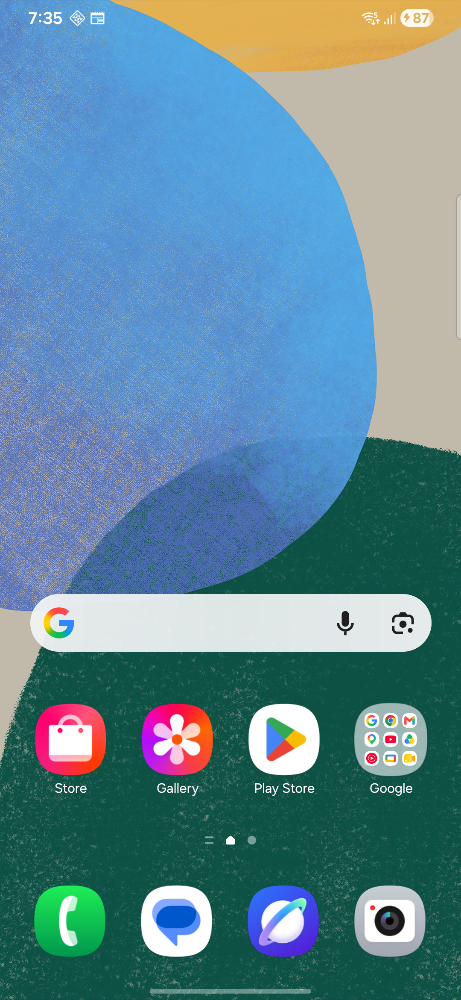

# WallPulse

A trend-forward live wallpaper experience built by **Govind Tank**.  
No data leaves your device. Everything runs locally on-device with customizable modes, live previews, and production-ready UI/UX.

## Screenshots

**Actual app screenshot from device:**



## Modes

- **Classic** — animated counter with particles and customization.
- **Time Flow** — 24-hour arc with unlock markers and glow/neon/glitch effects.
- **Particle Wave** — flowing particle wave driven by unlock data.
- **Gradient Pulse** — breathing gradient pulse with data-reactive intensity.
- **Data Stream** — matrix-like data stream visualization.
- **Aurora** — layered aurora borealis effect.
- **Matrix Rain** — classic falling matrix characters.
- **Cosmic Dust** — twinkling cosmic particles with nebula glow.
- **Liquid Metal** — reflective liquid metal bubble effect.
- **Cyber Grid** — retro-futuristic perspective grid.
- **Ocean Depth** — bioluminescent deep-sea particles.
- **Name Reveal** — matrix rain decodes and assembles your custom name at the center, then holds and loops.
- **DateTime** — time/date display with glow, neon, glitch, and shadow effects.
- **Battery** — battery level visualization with color-reactive fill.
- **Steps** — step count shown as a rising fill meter.
- **Notifications** — notification count as floating bubbles.

## Setup

1. Install the app.
2. Open it and choose a mode from the grid.
3. Tap **Set Wallpaper** or tap **Random** / **Trending** to pick a mode.
4. Customize colors, effects, font, spacing, and animation from the mode settings.

## Privacy

Unlock counts and history are stored locally only. No analytics, no network calls.

## Build

```bash
cd datalivewallpaper
ANDROID_HOME=$ANDROID_HOME JAVA_OPTS="-Djava.net.preferIPv4Stack=true" ./gradlew assembleDebug
```

## Repo

- GitHub: https://github.com/govindtank/unlock-count-live-wallpaper
- Package: `com.govindtank.wallpulse`

## License

MIT
