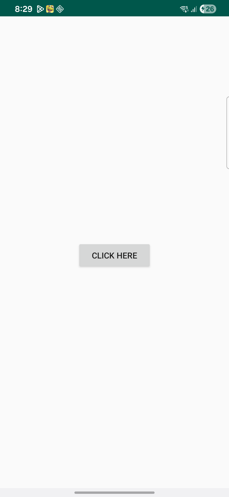
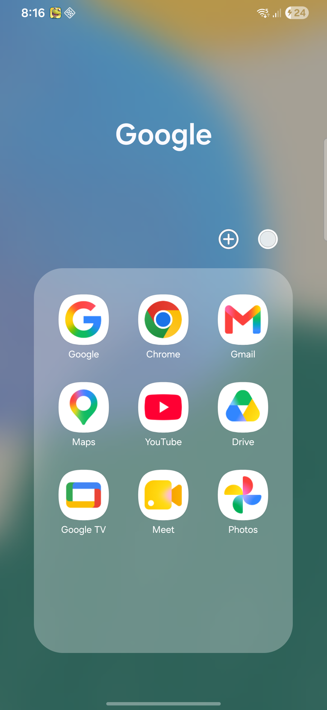

# Unlock Count Live Wallpaper

A modernized Android live wallpaper that tracks how many times you unlock your phone each day and renders an animated counter on your home screen.

## Screenshots

| Home | Wallpaper Preview |
|------|-------------------|
|  |  |

## What it does

- Counts daily unlocks via `ACTION_USER_PRESENT`
- Animates counter transitions with interpolated digit motion
- Simple launcher screen with one-tap wallpaper setting
- Supports wallpaper preview without registering the broadcast receiver

## How to use

1. Install the app
2. Open it and tap **CLICK HERE**
3. Select **Unlock Count Live Wallpaper** from the live wallpaper picker
4. Set it as your home screen wallpaper

## Tech

- Kotlin
- `WallpaperService` + `SurfaceHolder`
- `SharedPreferences` for daily counter state
- `PreferenceFragmentCompat` for settings
- Modern AndroidX dependencies with Gradle 8.7

## Setup

```bash
git clone https://github.com/govindtank/unlock-count-live-wallpaper.git
cd unlock-count-live-wallpaper
./gradlew assembleDebug
adb install -r app/build/outputs/apk/debug/app-debug.apk
```

## Possible features

- Per-day history and weekly averages
- Theme colors and font choices
- Haptic feedback on unlock transitions
- Export daily unlock stats to CSV
- Bedtime dim mode

## Status

Working first version.
